# Exercice 3 - Création d’une application web Node.js


---

## Table des matières
1. [Exercice 3 — Création d’une application web Node.js](#exercice-3---création-dune-application-web-nodejs)
    - [Contexte](#contexte)
    - [Étape 1 : Créer le dossier node-app](#étape-1--créer-le-dossier-node-app)
    - [Étape 2 : Initialiser npm et installer Express](#étape-2--initialiser-npm-et-installer-express)
    - [Étape 3 : Créer server.js avec les routes](#étape-3--créer-serverjs-avec-les-routes)
    - [Étape 4 : Créer .dockerignore](#étape-4--créer-dockerignore)
    - [Étape 5 : Créer le Dockerfile initial](#étape-5--créer-le-dockerfile-initial)
    - [Étape 6 : Construire l’image Docker](#étape-6--construire-limage-docker)
    - [Étape 7 : Lancer le conteneur](#étape-7--lancer-le-conteneur)
    - [Étape 8 : Tester les routes](#étape-8--tester-les-routes)
    - [Étape 9 : Optimiser le Dockerfile et health check](#étape-9--optimiser-le-dockerfile-et-health-check)
    - [Étape 10 : Reconstruire l’image optimisée](#étape-10--reconstruire-limage-optimisée)
    - [Étape 11 : Comparer les tailles des images](#étape-11--comparer-les-tailles-des-images)
    - [Étape 12 : Tester le health check](#étape-12--tester-le-health-check)

---

## Exercice 3 — Création d’une application web Node.js

### Contexte
Containerisation d’une application web complète avec Node.js et Express, création d’images Docker, optimisation et health check.

---

### Étape 1 : Créer le dossier node-app
**Commande :**
```bash
mkdir node-app
cd node-app
````

**Explication :**
Crée le dossier pour le projet Node.js.

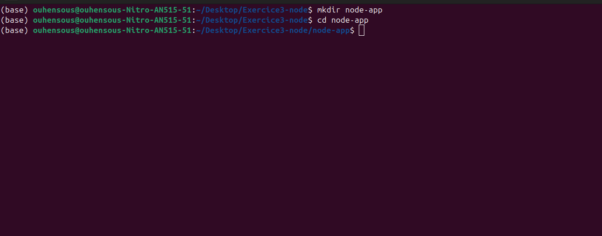

---

### Étape 2 : Initialiser npm et installer Express

**Commandes :**

```bash
npm init -y
npm install express
```

**Explication :**
Initialise le projet npm et installe Express pour créer le serveur web.

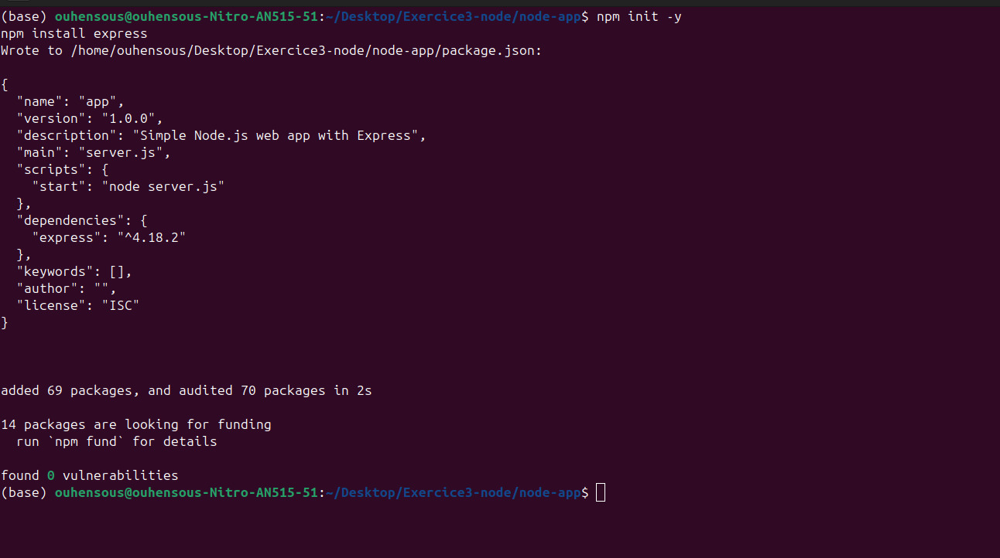

---

### Étape 3 : Créer server.js avec les routes

**Explication :**
Contient les routes :

* `/` : Page d’accueil
* `/api/health` : Status de l’application
* `/api/info` : Informations sur l’environnement
* `/api/time` : Heure actuelle

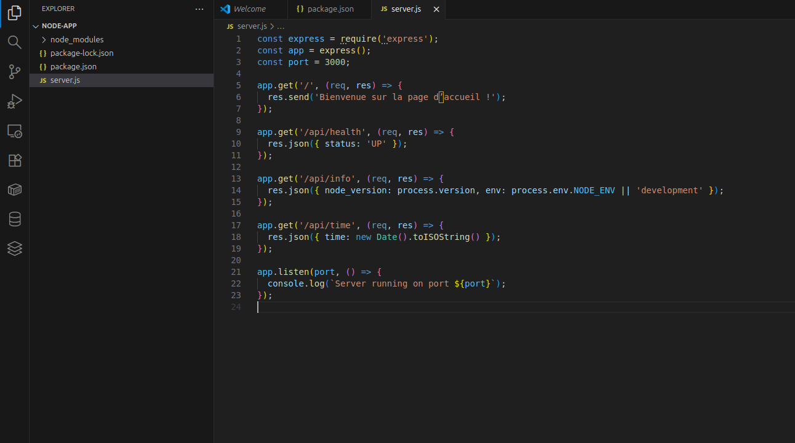

---

### Étape 4 : Créer .dockerignore

**Commande :**

```text
node_modules
npm-debug.log
```

**Explication :**
Exclut les fichiers et dossiers inutiles de l’image Docker.

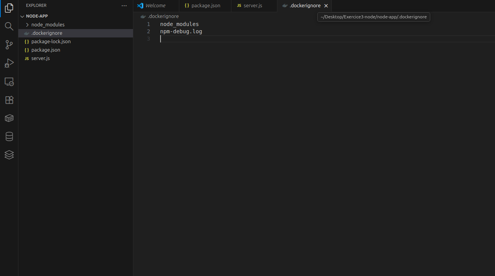

---

### Étape 5 : Créer le Dockerfile initial

**Explication :**
Définit l’image Node, copie les fichiers, installe les dépendances et expose le port 3000.

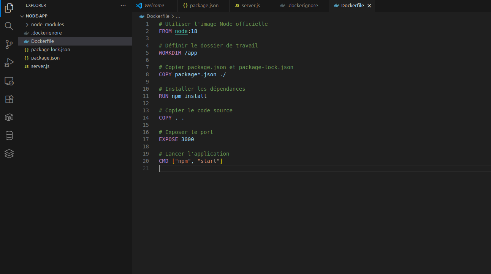

---

### Étape 6 : Construire l’image Docker

**Commande :**

```bash
docker build -t node-app:1.0 .
```

**Explication :**
Construit l’image Docker pour le projet Node.js.

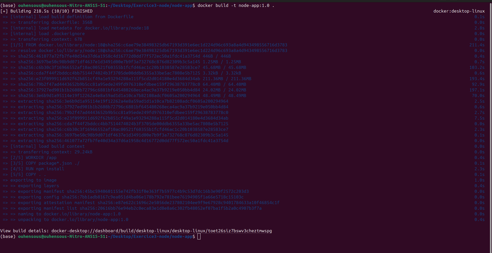

---

### Étape 7 : Lancer le conteneur

**Commande :**

```bash
docker run -d -p 3000:3000 --name node-app node-app:1.0
```

**Explication :**
Lance le conteneur sur le port 3000.

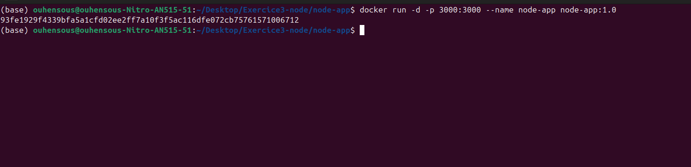

---

### Étape 8 : Tester les routes

**Commandes :**

```bash
curl http://localhost:3000/
curl http://localhost:3000/api/health
curl http://localhost:3000/api/info
curl http://localhost:3000/api/time
```

**Explication :**
Vérifie que l’application fonctionne et que toutes les routes répondent correctement.

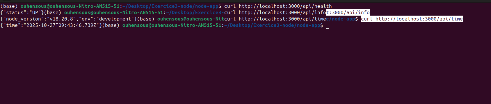

---

### Étape 9 : Optimiser le Dockerfile et health check

**Explication :**

* Utiliser `node:18-alpine` pour réduire la taille
* Ajouter `npm install --production`
* Ajouter un health check pour surveiller le conteneur

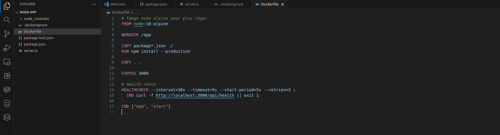

---

### Étape 10 : Reconstruire l’image optimisée

**Commande :**

```bash
docker build -t node-app:1.1 .
```

**Explication :**
Reconstruit l’image optimisée avec health check intégré.

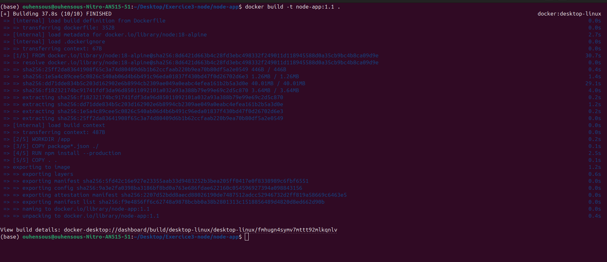

---

### Étape 11 : Comparer les tailles des images

**Commande :**

```bash
docker images node-app
```

**Explication :**
Permet de comparer la taille de l’image initiale et optimisée.

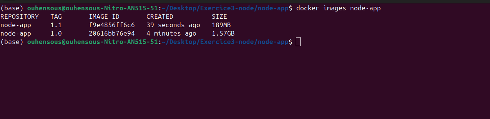

---

### Étape 12 : Tester le health check

**Commande :**

```bash
docker inspect --format='{{json .State.Health}}' node-app
```

**Explication :**
Vérifie si le conteneur est `healthy` ou `unhealthy`.

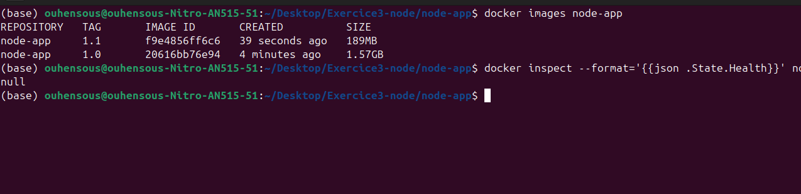

```

```
